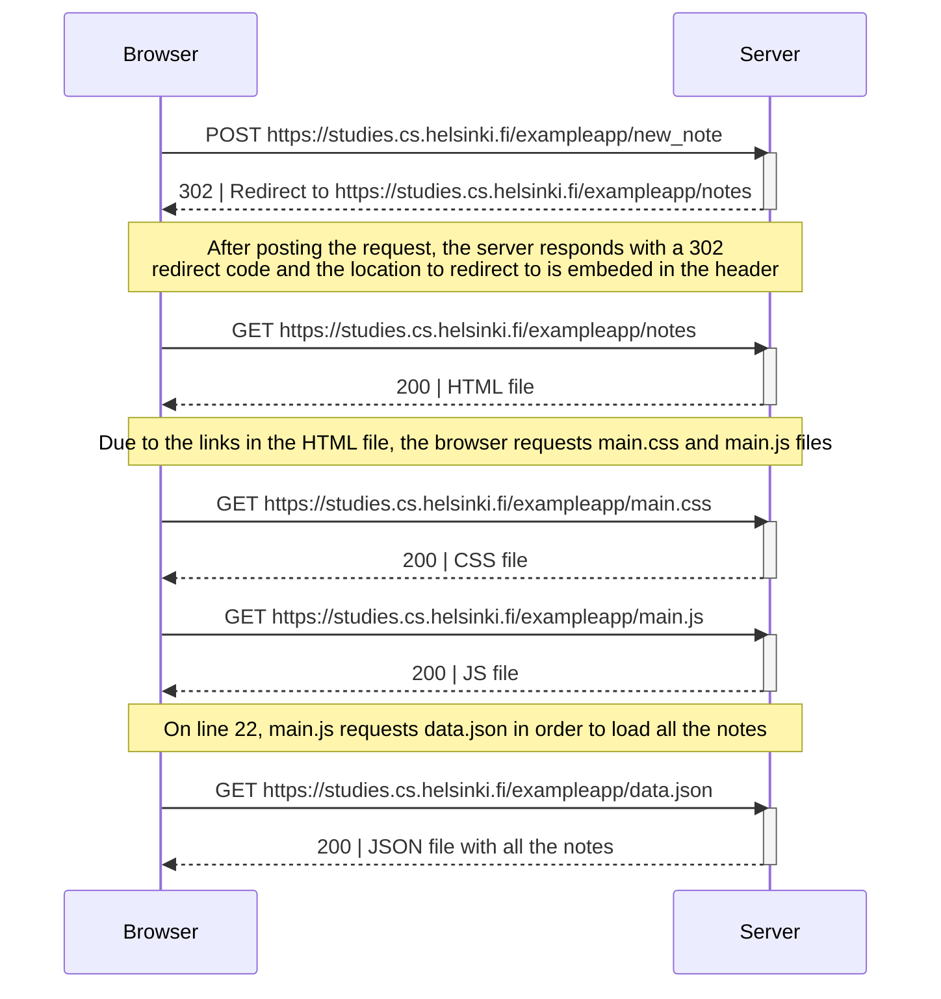

```mermaid
sequenceDiagram

    participant B as Browser
    participant S as Server

    B->>S:POST https://studies.cs.helsinki.fi/exampleapp/new_note
    activate S
    S-->>B:302 | Redirect to https://studies.cs.helsinki.fi/exampleapp/notes
    deactivate S

    Note over B,S: After posting the request, the server responds with a 302<br> redirect code and the location to redirect to is embeded in the header

    B->>S: GET https://studies.cs.helsinki.fi/exampleapp/notes
    activate S
    S-->>B: 200 | HTML file
    deactivate S

    Note over B,S: Due to the links in the HTML file, the browser requests main.css and main.js files

    B->>S: GET https://studies.cs.helsinki.fi/exampleapp/main.css
    activate S
    S-->>B: 200 | CSS file
    deactivate S

    B->>S: GET https://studies.cs.helsinki.fi/exampleapp/main.js
    activate S
    S-->>B: 200 | JS file
    deactivate S

    Note over B,S: On line 22, main.js requests data.json in order to load all the notes

    B->>S: GET https://studies.cs.helsinki.fi/exampleapp/data.json
    activate S
    S-->>B: 200 | JSON file with all the notes
    deactivate S


```
