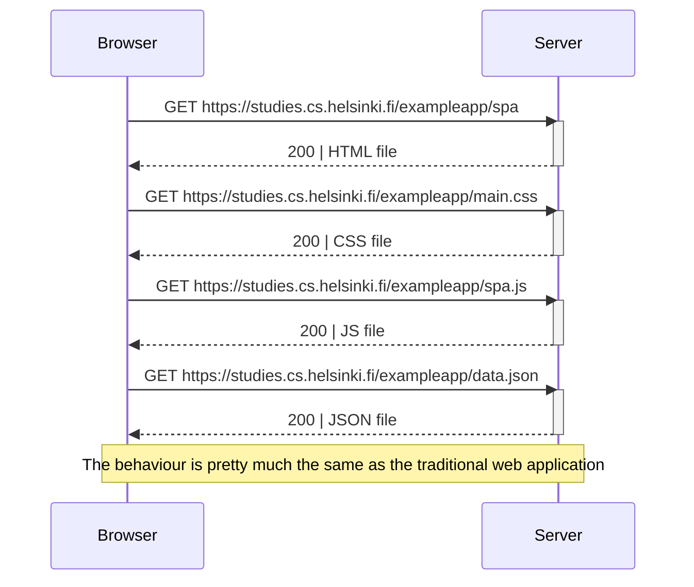

```mermaid
sequenceDiagram
    participant B as Browser
    participant S as Server

    B->>S:GET https://studies.cs.helsinki.fi/exampleapp/spa
    activate S
    S-->>B:200 | HTML file
    deactivate S

    B->>S:GET https://studies.cs.helsinki.fi/exampleapp/main.css
    activate S
    S-->>B:200 | CSS file
    deactivate S

    B->>S:GET https://studies.cs.helsinki.fi/exampleapp/spa.js
    activate S
    S-->>B:200 | JS file
    deactivate S

    B->>S:GET https://studies.cs.helsinki.fi/exampleapp/data.json
    activate S
    S-->>B:200 | JSON file
    deactivate S

    Note over B,S: The behaviour is pretty much the same as the traditional web application

```
