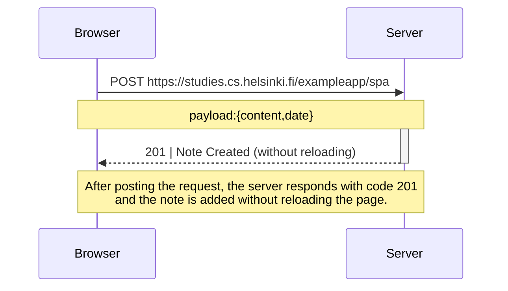

```mermaid
sequenceDiagram
participant B as Browser
participant S as Server

    B->>S: POST https://studies.cs.helsinki.fi/exampleapp/spa
        Note over B,S: payload:{content,date}
    activate S
    S-->>B: 201 | Note Created (without reloading)
    deactivate S

    Note over B,S: After posting the request, the server responds with code 201 <br> and the note is added without reloading the page.

```
